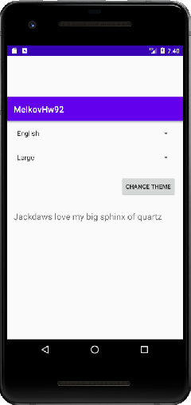

## Задача №2
### Переключение отступов в приложении

**Задание:**

Продолжаем работу над приложением из домашнего задания “Переключение языка”. Добавьте на экран переключения языков следующие элементы:

- Spinner с выбором темы с разной политикой отступов — “крупная, средняя и мелкая”.
- Кнопка ОК — по клику на кнопку во всем приложении меняется политика отступов.
- Необходимо создать 3 темы для приложения соответственно политике отступов, применяемой ко всем элементам приложения. Крупная тема: с отступами 1dpi Средняя тема: с отступами 3dpi Мелкая тема: с отступами 10dpi

